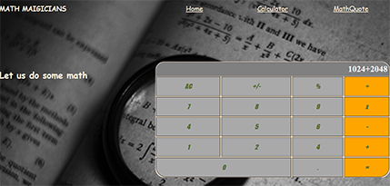

# Math Magicians (Online Calculator)

> Calculator made with React framework, containing basic mathematical operations

## Built With

- Javascript
- JSX
- CSS
- Markdown
- WebPack
- React

## Live Deployment

> The website is built using React and deployed using Netlify

[Math Magicians Link](https://mathematical-maigicians-online.netlify.app/)

## Getting Started

**Set up a linter for HTML, CSS and JS**

To get a local copy up and running follow these simple example steps.

1. Clone this repository or download the Zip folder:

**``git clone git@github.com:tinatsina/math-magicians-online.git``**

1. Navigate to the location of the folder in your machine:

**``you@your-Pc-name:~$ cd <folder>``**

**Git**
**Node JS (preferably any LTS version) for linters**

## Author

👤 **Tinaye Hamufari Tsinakwadi**

> Aspiring web developer mainly interested in minimal code. Research interests include Database design and IOT.

- [GitHub](https://github.com/tinatsina)
- [Twitter](https://twitter.com/TinayeT)
- [LinkedIn](https://www.linkedin.com/in/tinayetsina/)

Please feel free to contact us anytime

## Show your support

Give a ⭐️ if you like this project!

## Acknowledgments

- Hat tip to Microverse

## 📝 License

- This project is [Mozilla](./LICENSE) licensed.
